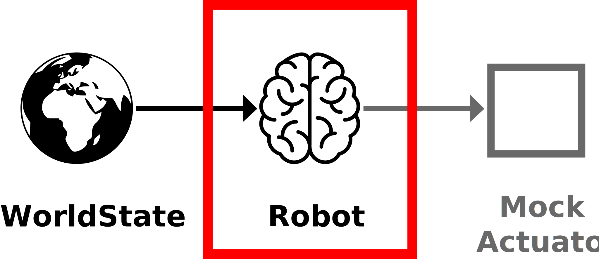
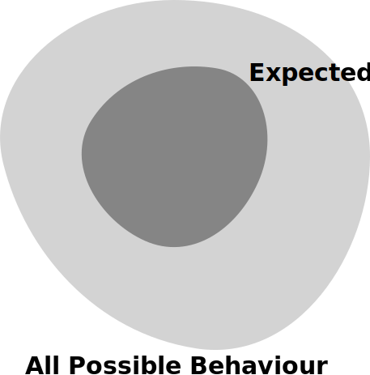

# Mocking in Rust

<p>
    <a href="http://donaldwhyte.co.uk">Donald Whyte</a>
    / <a href="http://twitter.com/donald_whyte">@donald_whyte</a>
</p>

[NEXT]
### About Me

<table class="bio-table">
  <tr>
    <td></td>
  </tr>
  <tr>
    <td>TODO</td>
  </tr>
</table>

[NEXT]
## Outline

1. Unit Testing in Rust
2. Why Mock?
3. Mocking in Rust with `double`
4. Pattern Matching
5. Limitations


[NEXT SECTION]
## 1. Unit Testing


_note_
* classist vs mockist testing
    - look up newer literature for this
* say that we're going to start w/ classist testing then move to mockist
* basic Rust unit test
* chosen unit test framework
* same unit tests as before but in new framework

Correctness in our programs means that our code does what we intend for it to do. Rust is a programming language that cares a lot about correctness, but correctness is a complex topic and isn’t easy to prove. Rust’s type system shoulders a huge part of this burden, but the type system cannot catch every kind of incorrectness. As such, Rust includes support for writing software tests within the language itself.

(source: https://doc.rust-lang.org/book/second-edition/ch11-00-testing.html)

[NEXT]
Create library:

```bash
cargo new some_lib
cd some_lib
```

Test fixture automatically generated:

```rust
> cat src/lib.rs

#[cfg(test)]
mod tests {
    #[test]
    fn it_works() {
        // test code in here
    }
}
```
<!-- .element class="small" -->

[NEXT]
Run all tests:

```cpp
> cargo test

   Compiling some_lib v0.1.0 (file:///Users/donaldwhyte/some_lib)
    Finished dev [unoptimized + debuginfo] target(s) in 2.99 secs
     Running target/debug/deps/some_lib-4ea7f66796617175

running 1 test
test tests::it_works ... ok

test result: ok. 1 passed; 0 failed; 0 ignored; 0 measured

   Doc-tests some_lib

running 0 tests

test result: ok. 0 passed; 0 failed; 0 ignored; 0 measured
```

[NEXT]
Write unit tests for a module by defining a private `tests` module in its source file.

<pre><code data-noescape class="rust">// production code
pub fn add_two(num: i32) -> i32 {
    num + 2
}

<mark>#[cfg(test)]</mark>
<mark>mod tests {</mark>
<mark>    // test code in here</mark>
<mark>}</mark>
</code></pre>

_note_
Annotate module so it's only built with `cargo test`.

[NEXT]
Add isolated test functions to private `tests` module.

<pre class="medium"><code data-noescape class="rust">// ...prod code...

#[cfg(test)]
mod tests {
    use super::*;  // import production symbols from parent module

<mark>    #[test]</mark>
    fn ensure_two_is_added_to_negative() {
        assert_eq!(0, add_two(-2));
    }
    #[test]
    fn ensure_two_is_added_to_zero() {
        assert_eq!(2, add_two(0));
    }
    #[test]
    fn ensure_two_is_added_to_positive() {
        assert_eq!(3, add_two(1));
    }
}
</code></pre>

_note_
Emphasise the fact that each function is a separate, isolated test.

[NEXT]
```
dwhyte-mbp2:some_lib donaldwhyte$ cargo test
    Finished dev [unoptimized + debuginfo] target(s) in 0.0 secs
     Running target/debug/deps/some_lib-4ea7f66796617175

running 3 tests
test tests::ensure_two_is_added_to_negative ... ok
test tests::ensure_two_is_added_to_positive ... ok
test tests::ensure_two_is_added_to_zero ... ok

test result: ok. 3 passed; 0 failed; 0 ignored; 0 measured

   Doc-tests some_lib

running 0 tests

test result: ok. 0 passed; 0 failed; 0 ignored; 0 measured
```

[NEXT]
Rust has native support for:

* documentation tests
* integration tests

Focus of talk is mocking, so these are not covered here.


[NEXT SECTION]
## 2. Why Mock?


[NEXT]


_note_
Here's a component hierarchy.

[NEXT]


_note_
Suppose we want a test for the red component at the top there.

The component has three dependencies, or collaborators, which we build and pass
into component at construction.

These collaborators might be rely on external systems or require a large amoun
of setup. This makes testing the component difficult, because we either have to
ensure these external systems are available and in the right state, or write
lots more test code to setup the collaborators.

Since we aim to write tests for most of our components (or should), this extra
effort builds up and results in huge amounts of development time taken up by
tests.

...so then teams end up just not writing tests.

[NEXT]


_note_
To avoid this, we replace the implementations of these collaborators with much
simpler, fake implementations.

[NEXT]


_note_
No more environment dependencies, no more massive setup. It becomes much
quicker and easier to write the tests.

It also makes them less brittle. That is, they're less likely to break when
the real, concrete dependencies are changed (this is a good and bad thing).

[NEXT]
## What to Eliminate

Anything non-deterministic that can't be reliably controlled within a unit test.

[NEXT]
**External data sources** &mdash; files, databases

**Network connections** &mdash; services

**External code dependencies** &mdash; libraries

[NEXT]
### You Might Also Want to Eliminate

**Heavyweight internal code dependencies.**

* simpler test code
* makes individual tests less brittle
* downsides to eliminating these dependencies

_note_
Downsides to testing internal code dependencies:

* component is tested with mock collaborators that behave like you *think* they do
* real collaborators may behave differently
* real collaborators behaviour may *change*
* unit test with mocks won't pick that up
* still need integration tests to ensure real components work together

Despite these downsides, some believe the cost is worth simpler tests, because
they:

* encourage developers to write more tests, since it requires less work
* tests are smaller, generally test one thing
    * failures easier to understand
* tests are more maintainable
    * easy to understand
    * easy to change

[NEXT]
## Solution: Use Test fble


[NEXT]
A **test double** is an object or function substituted for a "real" (production ready) object during testing.

Should appear exactly the same as a **"real"** production instance to its clients (collaborators).

Term originates from a notion of a _"stunt double"_ in films.

_note_
This is *how* we eliminate these unwanted dependencies from our tests.

Similar to using a stunt double in films, where viewers don't notice that
stunts are performed by a different actor.

[NEXT]
## Types

* **Stubs** return hard-coded values
* **Spies** record the code's interaction with collaborators
    * times method called and passed arguments
* **Mocks** return hard-coded values and verify interaction
    * both a stub and a spy

[NEXT]
**Mocks** are the focus of this talk.

_note_
WHY? Mocks are the most flexible. They're a superset of stubs and spies.

[NEXT SECTION]
## 3. Mocking in Rust Using `double`


[NEXT]
## Coin Flipper


* A simple game to flip a coin
* `CoinFlipper` class implements the game
* It interacts with a random number generator
* We can change a number generator at runtime
* Goal is to **test** `CoinFlipper`

_note_
We can change a number generator at runtime, using dependency injection

[NEXT]
## Interfaces

```cpp
// Simplified version of `Rng` trait in the `rand` crate
pub trait Rng {
    fn next_f64(&mut self) -> f64;
}

pub enum CoinFlip {
    Heads,
    Tails,
}
```

[NEXT]
## Implementation

```rust
pub struct CoinFlipper {
    rng: Rng,
}

impl CoinFlipper {
    pub fn new(rng: Rng) -> CoinFlipper {
        CoinFlipper {
            rng: rng
        }
    }

    pub fn flip_coin(&mut self) -> {
        let r = rng.next_f64();
        if r < 0.5 {
            CoinFlip::Heads
        } else {
            CoinFlip::Tails
        }
    }
}
```
<!-- .element class="medium" -->

[NEXT]
## Playing the Game

`flip` is either `Heads` or `Tails`.

```rust
fn play() {
    // Construct a particular RNG implementation
    let rng = SomeRngImplementation();

    // Create a game
    let mut game = CoinFlipper(rng);

    // Start playing
    let flip = game.flip_coin();
    if flip == CoinFlip::Heads {
        println!("Heads!");
    } else {
        println!("Tails!");
    }
}
```

[NEXT]


* One collaborator &mdash; `Rng`
* Real RNG is non-deterministic
* We want to test `CoinFlipper` produces both results
  - we also want these tests to be repeatable
  - without relying on an external environment

[NEXT]
<!-- .slide: class="large-slide" -->
**Let's mock `Rng`.**

[NEXT]
## Double to the Rescue!

[NEXT]
* **generate** mock trait implementations using macros
* flexible configuration of mock's **behaviour**
* can make simple and complex **assertions** on mock calls
* **pattern matching** for call arguments

[NEXT]
<!-- .slide: class="large-slide" -->
**Two Core Design Principles**

[NEXT]
<!-- .slide: class="large-slide" -->
**1. Rust Stable First**

_note_
Emphasise how these goals has had the biggest influence on the design of the
library. It's at the core of the library and what differentiates it from other
mocking libraries in Rust.

Other Mocking Libraries

Supports rust stable via code generation and less features:
  - https://github.com/kriomant/mockers

Supports Rust stable, but lots of code boilerplate and less features:
  - https://github.com/iredelmeier/pseudo

Require changing prod code (and thus, can't be used for external `traits`) and require nightly:
  - https://github.com/craftytrickster/mock_me
  - https://github.com/DavidDeSimone/mock_derive
  - https://github.com/CodeSandwich/Mocktopus
  - https://github.com/mindsbackyard/galvanic-mock

[NEXT]
<!-- .slide: class="large-slide" -->
**2. No Changes to Production Code**

[NEXT]
## Defining Mock Collaborators

[NEXT]
**`mock_trait!`**

<pre><code data-noescape class="rust">pub trait Rng {
    fn next_f64(&mut self) -> f64;
}

<mark>mock_trait!(</mark>
<mark>    MockRng,</mark>
<mark>    next_f64() -> f64);</mark>
</code></pre>

[NEXT]
**`mock_trait!`**

```rust
mock_trait!(
    NameOfMockStruct,
    method1_name(arg1_type, ..., argM_type) -> return_type,
    method2_name(arg1_type, ..., argM_type) -> return_type
    ...
    methodN_name(arg1_type, ..., argM_type) -> return_type);
```

[NEXT]
**`mock_method!`**

Generate implementations of all methods in mock `struct`.

<pre><code data-noescape class="rust">pub trait Rng {
    fn next_f64(&mut self) -> f64;
}

mock_trait!(
    MockRng,
    next_f64() -> f64);

<mark>impl Rng for MockRng {</mark>
<mark>    mock_method!(next_f64(&mut self) -> f64);</mark>
<mark>}</mark>
</code></pre>

[NEXT]
**`mock_method!`**

```rust
impl TraitToMock for NameOfMockStruct {

  mock_method!(
    method1_name(&self, arg1_type, ..., argM_type) -> return_type);

  mock_method!(
    method2_name(&mut self, arg1_type, ..., argM_type) -> return_type);

  ...

  mock_method!(
    methodN_name(&mut self, arg1_type, ..., argM_type) -> return_type);

}
```
<!-- .element class="medium-large" -->

[NEXT]
Full code to generate a mock implementation of a `trait`:

```rust
mock_trait!(
    MockRng,
    next_f64() -> f64);

impl Rng for MockRng {
    mock_method!(next_f64(&mut self) -> f64);
}
```

_note_
Emphasise this is the only boilerplate needed.

[NEXT]
## Using Generated Mocks in Tests

<pre class="medium"><code data-noescape class="rust">#[test]
fn test_coin_flipper_yielding_heads() {
    // GIVEN:
<mark>    let rng = MockRng::default();</mark>
<mark>    rng.next_f64.return_value(0.25);</mark>

    // WHEN:
    let mut game = CoinFlipper::new(rng);
    let flip = game.flip_coin();

    // THEN:
    assert_eq!(CoinFlip::Heads, flip);

<mark>    assert!(rng.next_f64.called());</mark>
<mark>    assert!(rng.next_f64.called_with(()));</mark>
<mark>    assert_eq!(1, rng.next_f64.num_calls());</mark>
}
</code></pre>

[NEXT]
### GIVEN: Setting Mock Behaviour

* Define value to return for mocked method:
  - for all calls
  - for specific input arguments
* Define sequence of values to return
* Define `fn` or closure that transforms input args

_note_
Mocks can be configured to return a single value, a sequence of values (one
value for each call) or invoke a function/closure. Additionally, it is possible
to make a mock return special value /invoke special functions when specific
arguments are passed in.

[NEXT]
```rust
pub trait ProfitForecaster {
    fn profit_at(timestamp: u64) -> f64;
}

pub fn forecast_profit_over_time(forecaster: &ProfitForecaster,
                                 start: u64,
                                 end: u64) -> Vec<f64>
{
  (start..end)
      .map(|t| forecaster.profit_at(t))
      .collect()
}
```

[NEXT]
```
mock_trait!(
    MockForecaster,
    profit_at(u64) -> f64);

impl ProfitForecaster for MockForecaster {
    mock_method!(profit_at(&self, timestamp: u64) -> f64);
}
```

[NEXT]
<pre><code data-noescape class="rust">#[test]
fn no_return_value_specified() {
  // GIVEN:
  let forecaster = MockForecaster::default();

  // WHEN:
  let profit_over_time = forecast_profit_over_time(forecaster, 0, 3);

  // THEN:
  // default value of return type is used if no value is specified
<mark>  assert_eq!(vec!(0, 0, 0), profit_over_time);</mark>
}
</code></pre>

[NEXT]
<pre><code data-noescape class="rust">#[test]
fn single_return_value() {
  // GIVEN:
  let forecaster = MockForecaster::default();
<mark>  forecaster.profit_at.return_value(10);</mark>

  // WHEN:
  let profit_over_time = forecast_profit_over_time(forecaster, 0, 3);

  // THEN:
<mark>  assert_eq!(vec!(10, 10, 10), profit_over_time);</mark>
}
</code></pre>

[NEXT]
<pre><code data-noescape class="rust">#[test]
fn multiple_return_values() {
  // GIVEN:
  let forecaster = MockForecaster::default();
<mark>  forecaster.profit_at.return_values(1, 5, 10);</mark>

  // WHEN:
  let profit_over_time = forecast_profit_over_time(forecaster, 0, 3);

  // THEN:
<mark>  assert_eq!(vec!(1, 5, 10), profit_over_time);</mark>
}
</code></pre>

[NEXT]
<pre><code data-noescape class="rust">#[test]
fn return_value_for_specific_arguments() {
  // GIVEN:
  let forecaster = MockForecaster::default();
<mark>  forecaster.profit_at.return_value(10);</mark>
<mark>  forecaster.profit_at.return_value_for((1), 5);</mark>

  // WHEN:
  let profit_over_time = forecast_profit_over_time(forecaster, 0, 3);

  // THEN:
<mark>  assert_eq!(vec!(10, 5, 10), profit_over_time);</mark>
}
</code></pre>

[NEXT]
<pre><code data-noescape class="rust">#[test]
fn using_closure_to_compute_return_value() {
  // GIVEN:
  let forecaster = MockForecaster::default();
<mark>  forecaster.profit_at.use_closure(|t| t * 5 + 1);</mark>

  // WHEN:
  let profit_over_time = forecast_profit_over_time(forecaster, 0, 3);

  // THEN:
<mark>  assert_eq!(vec!(0, 6, 11), profit_over_time);</mark>
}
</code></pre>

[NEXT]
<pre><code data-noescape class="rust">#[test]
fn using_closure_for_specific_return_value() {
  // GIVEN:
  let forecaster = MockForecaster::default();
<mark>  forecaster.profit_at.return_value(10);</mark>
<mark>  forecaster.profit_at.use_closure_for((2), |t| t * 5 + 1);</mark>

  // WHEN:
  let profit_over_time = forecast_profit_over_time(forecaster, 0, 3);

  // THEN:
<mark>  assert_eq!(vec!(0, 10, 11), profit_over_time);</mark>
}
</code></pre>

[NEXT]
### Precedence Order

|   |   |
| - | - |
|   | **Behaviour for specific inputs** |
| 0 | `use_closure_for((args), closure)` |
| 1 | `use_fn_for((args), func)` |
| 2 | `return_value_for((args), value)` |
|   | **Behaviour for any inputs** |
| 3 | `use_fn(func)` |
| 4 | `use_closure(closure)` |
| 5 | `return_value(value)` |
|   | **When no behaviour is set** |
| 6 | `ReturnType::default()` |
<!-- .element class="medium-table-text" -->

[NEXT]
### `Option` Helpers

Use `return_some` and `return_none` for `Option<T>`.

```rust
struct User { };

pub trait UserStore {
    fn get_user(&self, id: u64) -> Option<User>;
}

mock_trait!(
    MockUserStore,
    get_user(u64) -> Option<User>);

impl UserStore for MockUserStore {
    mock_method!(get_user(&self, id: u64) -> Option<User>);
}
```

[NEXT]
<pre><code data-noescape class="rust">#[test]
fn returning_none() {
  // GIVEN:
  let store = MockUserStore::default();
<mark>  store.get_user.return_none();</mark>

  // WHEN:
  let output = store.get_user(42);

  // THEN:
<mark>  assert_eq!(None, output);</mark>
}
</code></pre>

[NEXT]
<pre><code data-noescape class="rust">#[test]
fn returning_some() {
  // GIVEN:
  let store = MockUserStore::default();
<mark>  store.get_user.return_some(User{});</mark>

  // WHEN:
  let output = store.get_user(42);

  // THEN:
<mark>  assert_eq!(Some(User{}), output);</mark>
}
</code></pre>

[NEXT]
### `Result` Helpers

Use `return_ok` and `return_err` for `Result<T>`.

```rust
struct User { };

pub trait UserStore {
    fn get_user(&self, id: u64) -> Result<User, String>;
}

mock_trait!(
    MockUserStore,
    get_user(u64) -> Result<User, String>);

impl UserStore for MockUserStore {
    mock_method!(get_user(&self, id: u64) -> Result<User, String>);
}
```

[NEXT]
<pre><code data-noescape class="rust">#[test]
fn returning_error() {
  // GIVEN:
  let store = MockUserStore::default();
<mark>  store.get_user.return_err("could not connect to DB");</mark>

  // WHEN:
  let output = store.get_user(42);

  // THEN:
<mark>  assert_eq!(Err("could not connect to DB"), output);</mark>
}
</code></pre>

[NEXT]
<pre><code data-noescape class="rust">#[test]
fn returning_ok() {
  // GIVEN:
  let store = MockUserStore::default();
<mark>  store.get_user.return_ok(User{});</mark>

  // WHEN:
  let output = store.get_user(42);

  // THEN:
<mark>  assert_eq!(Ok(User{}), output);</mark>
}
</code></pre>

[NEXT]
### THEN: Asserting Mock Was Used in the Expected Way

Verify mocks are called the right number of times and with the right arguments.

[NEXT]
<pre><code data-noescape class="rust">#[test]
fn asserting_mock_was_called() {
  // GIVEN:
  let forecaster = MockForecaster::default();

  // WHEN:
  let profit_over_time = forecast_profit_over_time(forecaster, 0, 3);

  // THEN:
  // called at least once
<mark>  assert!(forecaster.profit_at.called());</mark>
  // called with argument 1 at least once
<mark>  assert!(forecaster.profit_at.called_with((1));</mark>
  // called at least once with argument 1 and 0
<mark>  assert!(forecaster.profit_at.has_calls((1), (0));</mark>
}
</code></pre>

[NEXT]
<pre class="medium"><code data-noescape class="rust">#[test]
fn asserting_mock_was_called_with_precise_constraints() {
  // GIVEN:
  let forecaster = MockForecaster::default();

  // WHEN:
  let profit_over_time = forecast_profit_over_time(forecaster, 0, 3);

  // THEN:
  // called at least once with argument 0 and 1, in that order
<mark>  assert!(forecaster.profit_at.has_calls_in_order((0), (1));</mark>
  // called exactly three times, once with 0, once with 1 and once with 2
<mark>  assert!(forecaster.profit_at.has_calls_exactly(</mark>
<mark>      (1), (0), (2));</mark>
  // called exactly three times, once with 0, once with 1 and once with 2,
  // and the calls were made in the specified order
<mark>  assert!(forecaster.profit_at.has_calls_exactly_in_order(</mark>
<mark>      (0), (1), (2));</mark>
}
</code></pre>

[NEXT]
### Generic Type Arguments

TODO

[NEXT]
### Methods that Return References

TODO

[NEXT SECTION]
## 4. Pattern Matching


_note_
When a mock function has been used in a test, we typically want to make assertions about what the mock has been called with.

[NEXT]
### Robot Decision Making


[NEXT]


|              |                                                            |
| ------------ | ---------------------------------------------------------- |
| `WorldState` | Struct containing current state of world. |
| `Robot`      | Processes state of the world and makes decisions on what do to next. |
| `Actuator`   | Manipulates the world. Used by `Robot` to act on the decisions its made. |

[NEXT]


```rust
pub struct WorldState {
    ...
}
```

[NEXT]


<pre class="medium"><code data-noescape class="rust">pub struct Robot {
    actuator: &mut Actuator
}

impl Robot {
    pub fn new(actuator: Actuator) -> Robot {
        Robot { actuator: &mut Actuator }
    }

    pub fn take_action(state: WorldState) {
<mark>        // Complex business logic that decides what actions</mark>
<mark>        // the robot should take.</mark>
<mark>        // This is what we want to test.</mark>
    }
  }
}
</code></pre>

[NEXT]


```rust
pub trait Actuator {
    fn move_forward(&mut self, amount: i32);
    fn speak(&mut self, message: &str, volume: u32);
}
```

[NEXT]
### Testing Robot's Decisions


[NEXT]
### Testing Robot's Decisions


[NEXT]


```rust
mock_trait!(
    MockActuator,
    move_forward(i32) -> (),
    speak(String, u32) -> ());

impl Actuator for MockActuator {
    mock_method!(move_forward(&mut self, amount: i32));
    mock_method!(speak(&mut self, message: &str, volume: u32));
}
```

[NEXT]
<pre><code data-noescape class="rust">#[test]
fn test_the_robot() {
    // GIVEN:
    let input_state = WorldState { ... };
    let actuator = MockActuator::default();

    // WHEN:
    {
        let robot = Robot::new(&actuator);
        robot.take_action(input_state);    
    }
    
    // THEN:
<mark>    assert!(actuator.move_forward.called_with(100));</mark>
}
</code></pre>

_note_
For example, suppose we're testing some logic that determines the next action of a robot. We might want to assert what this logic told the robot to do.

[NEXT]
Do we really care that the robot moved **_exactly_** 100 units?

_note_
Sometimes you might not want to be this specific. This can make tests being too rigid. Over specification leads to brittle tests and obscures the intent of tests. Therefore, it is encouraged to specify only what's necessary &mdash; no more, no less.

[NEXT]
<div class="behaviour_space_wrapper">
  
</div>

[NEXT]
<div class="behaviour_space_wrapper">
  
</div>

[NEXT]
<div class="behaviour_space_wrapper">
  
</div>

[NEXT]
<div class="behaviour_space_wrapper">
  
</div>

[NEXT]
<div class="behaviour_space_wrapper">
  
</div>

[NEXT]
TODO: summarise points made in diagrams above

[NEXT]
Match argument values to a patterns.

**Not exact values.**

Loosens test expectations, making them less brittle.

_note_
Emphasise how this is a pain 

[NEXT]
**`called_with_pattern()`**

<pre><code data-noescape class="rust">fn is_greater_than_or_equal_to_100(num: i32) -> bool {
    num >= 100
}

#[test]
fn test_the_robot() {
    let robot = MockRobot::default();
    test_complex_business_logic_that_makes_decisions(&robot);
<mark>    assert!(robot.move_forward.called_with_pattern(</mark>
<mark>        is_greater_than_or_equal_to_100</mark>
<mark>    ));</mark>
}
</code></pre>

[NEXT]
Use `p!` to generate matcher functions on-the-fly.

<pre><code data-noescape class="rust"><mark>use double::matcher::*;</mark>

#[test]
fn test_the_robot() {
    let robot = MockRobot::default();
    test_complex_business_logic_that_makes_decisions(&robot);
<mark>    assert!(robot.move_forward.called_with_pattern(</mark>
<mark>        p!(ge, 100)</mark>
<mark>    ));</mark>
}
</code></pre>

[NEXT]
#### Composite Matchers

Assert that a single arg should match many patterns.

```rust
// Assert robot moved between 100 and 200 units.
assert!(robot.move_forward.called_with_pattern(
    p!(all_of, vec!(
        p!(ge, 100),
        p!(le, 200)
    ))
));
```

[NEXT]
#### Composite Matchers

|                            |                                                    |
| -------------------------- | -------------------------------------------------- |
| `all_of(vec!(m1, ... mn))` | argument matches all of the matchers `m1` to `mn`. |
| `any_of(vec!(m1, ... mn))` | matches at least one of the matchers `m1` to `mn`. |
| `not(m)`                   | argument doesn't match matcher `m`.                |
<!-- .element class="medium-table-text" -->

[NEXT]
**`matcher!`**

Create tuple of arg matchers for multi-arg methods.

<pre><code data-noescape class="rust">use double::matcher::*;

#[test]
fn test_the_robot() {
    let robot = MockRobot::default();
    test_complex_business_logic_that_makes_decisions(&robot);
<mark>    assert!(robot.speak.called_with_pattern(</mark>
<mark>        matcher!( contains("Hello FOSDEM"), ge(0.7) )</mark>
<mark>    ));</mark>
}
</code></pre>

[NEXT]
TODO: reiterate that you're expanding the allowed behaviour space

[NEXT]
### Custom Matchers

_note_
If none of the built-in matchers fit your use case, you can define your own.

[NEXT]
### Custom Matchers

Let's test a HTTP request processor.

It responds to clients with JSON.

_note_
Suppose we were testing a restful service. We have some request handling logic. We want to test the handling logic responded to the request correctly. In this context, "correctly" means it responded with a JSON object that contains the "time" key.

[NEXT]
```rust
trait ResponseSender {
    fn send_response(&mut self, response: String);
}

fn request_handler(response_sender: &mut ResponseSender) {
    let num_records = /* ... business logic here ... */
    let response = format!(
        "{{ \"num_records\": {} }}",
        num_records);
    response_sender.send_response(response);
}
```

[NEXT]
Step 1: Mock the relevant `trait`.

```rust
mock_trait!(
    MockResponseSender,
    send_response(&str) -> ());

impl ResponseSender for MockResponseSender {
    mock_method!(send_response(&mut self, response: &str));
}
```

[NEXT]
Step 2: Write the test.

<pre><code data-noescape class="rust">#[test]
fn ensure_num_records_field_is_returned() {
    // GIVEN:
    let mut mock_sender = MockResponseSender::default();

    // WHEN:
    request_handler(&mock_sender);

    // THEN:
<mark>    // check the sender received a response that contains a</mark>
<mark>    // "num_records" field</mark>
}
</code></pre>

[NEXT]
How do we test this?

[NEXT]
Could check using exact string equality...

<pre><code data-noescape class="rust">#[test]
fn ensure_num_records_field_is_returned() {
    // GIVEN:
    let mut mock_sender = MockResponseSender::default();

    // WHEN:
    request_handler(&mock_sender);

    // THEN:
<mark>    assert!(mock_sender.send_response.called_with(</mark>
<mark>        "{ \"num_records\": 42 }"</mark>
<mark>    ));</mark>
}
</code></pre>

[NEXT]
Test is now tightly bound to implementation. Will break if:

* JSON spacing/formatting changes
* the value of "num_records" changes
* there are other fields in the response

**It's a brittle test!**

[NEXT]
Could use a substring matcher...

<pre><code data-noescape class="rust">#[test]
fn ensure_num_records_field_is_returned() {
    // GIVEN:
    let mut mock_sender = MockResponseSender::default();

    // WHEN:
    request_handler(&mock_sender);

    // THEN:
<mark>    assert!(mock_sender.send_response.called_with_pattern(</mark>
<mark>        p!(contains, "\"num_records\":")</mark>
<mark>    ));</mark>
}
</code></pre>

[NEXT]
Test is still tightly bound to implementation.

Will break if JSON spacing/formatting changes.

**No guarantee "num_records" is a key on the top-level JSON object.**

[NEXT]
Could extract the call arg, parse it as JSON and check the field exists.

<pre class="small"><code data-noescape class="rust">extern crate json;
use self::json;

#[test]
fn ensure_num_records_field_is_returned() {
    ...

    // THEN:
<mark>    let calls = mock_sender.calls();</mark>
<mark>    assert_eq!(1, calls.size());</mark>

    match json::parse(calls[0]) {
        Ok(json_value) => match json_value {
            Object(object) => match object.get("num_records") {
                Some(_) => true  // JSON object and has key -- success!
                None => panic!("JSON object but doesn't have key");
            },
            _ => panic!("not an object (must be another JSON type)");
        },
        Err(_) => panic!("not valid JSON");
    }
}
</code></pre>

[NEXT]
**Verbose** and hard to read test.

What if we want to test many requests with dozens of cases?

Testing like this results in a lot of **copy/paste**.

[NEXT]
#### Solution

Define a custom matcher.

[NEXT]
```rust
extern crate json;
use self::json;

fn is_json_object_with_key(arg: &str, key: &str) -> bool {
    match json::parse(str) {
        Ok(json_value) => match json_value {
            Object(object) => match object.get(key) {
                Some(_) => true // JSON object and has key
                None => false   // JSON object but doesn't have key
            },
            _ => false  // not an object (must be another JSON type)
        },
        Err(_) => false  // not valid JSON
    }
}
```

[NEXT]
```rust
fn ensure_num_records_field_is_returned() {
    // GIVEN:
    let mut mock_sender = MockResponseSender::default();

    // WHEN:
    request_handler(&mock_sender);

    // THEN:
    // expect a "num_records" field to be in the response JSON
    assert(response_sender.send_response.called_with_pattern(
        p!(is_json_object_with_key, "num_records")
    ));
    // DO NOT expect an "error" field to be in the response JSON
    assert(!response_sender.send_response.called_with_pattern(
        p!(is_json_object_with_key, "error")
    ));
}
```

_note_
Using the matcher then requires binding it to a parameter (using `p!`) and passing it to a mock assertion method.

[NEXT]
TODO: general takeaways


[NEXT SECTION]
## 5. Library Constraints


[NEXT]
TODO: mention that the vision for this library that this must be usable in `stable`

_note_
The vision for `double` is that must use `stable`.

TODO: this makes supporting some features difficult

here exist many other mocking libraries that use nightly compiler plugins. 

[NEXT]
### Type Limitations

* Argument/return value types must implement these traits:
  - `Clone`
  - `Debug`
  - `Eq`
  - `Hash`
* Only `pub trait`s can be mocked

_note_
TODO

[NEXT]
TODO: general takeaways of stable Rust limitations

TODO: reference the following libs: mockers, mock-derive, mock_me, mocktopus
  ^--- list how many support stable! arguments against the ones that use stable
  ^--- see what features limit nightly libs


[NEXT SECTION]
## Fin

[NEXT]
TODO: conclusion

[NEXT]
<!-- .slide: class="small-slide" -->
## Links

* these slides:
  - http://donsoft.io/mocking-in-rust-using-double
* double repository:
  - https://github.com/DonaldWhyte/double
* double documentation:
  - https://docs.rs/double/0.2.0/double/
* example code from this talk:
  - https://github.com/DonaldWhyte/mocking-in-rust-using-double/tree/master/code

[NEXT]
## Get In Touch

<div class="left-col">
  
</div>
<div class="right-col" style="text-center: left">
  <br />
  [don@donsoft.io](mailto:don@donsoft.io)<br />
  [@donald_whyte](http://twitter.com/donald_whyte)<br />
  <span class="github">https://github.com/DonaldWhyte</span>
</div>
<div class="clear-col"></div>

[NEXT]
## Image Credits

[Gregor Cresnar](https://www.flaticon.com/authors/gregor-cresnar)

[Zurb](https://www.flaticon.com/authors/zurb)

[Freepik](http://www.flaticon.com/authors/freepik)

[Dave Gandy](http://fontawesome.io/)
