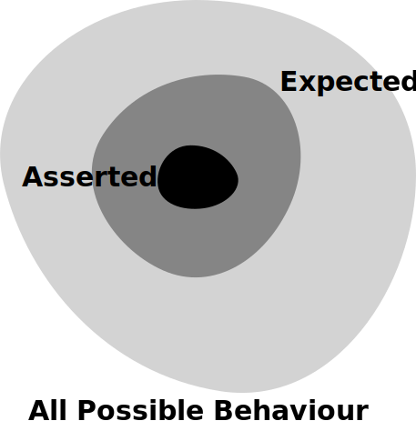

# Testing in Rust
#### A Primer in Testing and Mocking

<p>
  <a href="http://twitter.com/donald_whyte">@donald_whyte</a>
</p>

<div id="logo-notice">
  
  <p><strong>FOSDEM 2018</strong></p>
</div>

[NEXT]
### About Me

<div class="left-col1of3">
  
</div>
<div class="right-col2of3" style="text-center: left">
  <div style="height: 27px"></div>
  <ul>
    <li>Software Engineer @ <strong>Engineers Gate</strong></li>
    <li>Real-time trading systems</li>
    <li>Scalable data infrastructure</li>
    <li>Python/C++/Rust developer</li>
  </ul>
</div>
<div class="clear-col"></div>

[NEXT]
### Motivation
Rust focuses on memory safety.

While supporting advanced concurrency.

Does a great job at this.

[NEXT]
But even if our code is safe...

...we still need to make sure it's doing the **right** thing.

[NEXT]
### Outline

* Rust unit tests
* Mocking in Rust using `double`
* Design considerations


[NEXT SECTION]
## 1. Unit Tests


_note_
* classist vs mockist testing
    - look up newer literature for this
* say that we're going to start w/ classist testing then move to mockist
* basic Rust unit test
* chosen unit test framework
* same unit tests as before but in new framework

Correctness in our programs means that our code does what we intend for it to do. Rust is a programming language that cares a lot about correctness, but correctness is a complex topic and isn’t easy to prove. Rust’s type system shoulders a huge part of this burden, but the type system cannot catch every kind of incorrectness. As such, Rust includes support for writing software tests within the language itself.

(source: https://doc.rust-lang.org/book/second-edition/ch11-00-testing.html)

[NEXT]
Create library: `cargo new`

```bash
cargo new some_lib
cd some_lib
```

[NEXT]
Test fixture automatically generated:

```bash
> cat src/lib.rs
```

```rust
#[cfg(test)]
mod tests {
    #[test]
    fn it_works() {
        // test code in here
    }
}
```

[NEXT]
Write unit tests for a module by defining a private `tests` module in its source file.

<pre><code data-noescape class="rust">// production code
pub fn add_two(num: i32) -> i32 {
    num + 2
}

<mark>#[cfg(test)]</mark>
<mark>mod tests {</mark>
<mark>    // test code in here</mark>
<mark>}</mark>
</code></pre>

_note_
Annotate tests module with `#[cfg(test)]` so it's only built with `cargo test`.

This module will also _run_ when `cargo test` is invoked.

"This is the automatically generated test module. The attribute cfg stands for configuration, and tells Rust that the following item should only be included given a certain configuration option. In this case, the configuration option is test, provided by Rust for compiling and running tests. By using this attribute, Cargo only compiles our test code if we actively run the tests with cargo test. This includes any helper functions that might be within this module, in addition to the functions annotated with #[test]."

Source: https://doc.rust-lang.org/book/second-edition/ch11-03-test-organization.html

[NEXT]
Add isolated test functions to private `tests` module.

<pre class="medium"><code data-noescape class="rust">// ...prod code...

#[cfg(test)]
mod tests {
    use super::*;  // import production symbols from parent module

<mark>    #[test]</mark>
    fn ensure_two_is_added_to_negative() {
        assert_eq!(0, add_two(-2));
    }
    #[test]
    fn ensure_two_is_added_to_zero() {
        assert_eq!(2, add_two(0));
    }
    #[test]
    fn ensure_two_is_added_to_positive() {
        assert_eq!(3, add_two(1));
    }
}
</code></pre>

_note_
Emphasise the fact that each function is a separate, isolated test.

[NEXT]
`cargo test`

```bash
user:some_lib donaldwhyte$ cargo test
    Finished dev [unoptimized + debuginfo] target(s) in 0.0 secs
     Running target/debug/deps/some_lib-4ea7f66796617175

running 3 tests
test tests::ensure_two_is_added_to_negative ... ok
test tests::ensure_two_is_added_to_positive ... ok
test tests::ensure_two_is_added_to_zero ... ok

test result: ok. 3 passed; 0 failed; 0 ignored; 0 measured
```

[NEXT]
Rust has native support for:

* documentation tests
* integration tests

_note_
Focus of talk is mocking, so these are not covered here.


[NEXT SECTION]
## 2. What is Mocking?


[NEXT]


_note_
Here's a component hierarchy.

[NEXT]


_note_
Suppose we want a test for the red component at the top there.

The component has three dependencies, or collaborators, which we build and pass
into component at construction.

These collaborators might be rely on external systems or require a large amoun
of setup. This makes testing the component difficult, because we either have to
ensure these external systems are available and in the right state, or write
lots more test code to setup the collaborators.

Since we aim to write tests for most of our components (or should), this extra
effort builds up and results in huge amounts of development time taken up by
tests.

...so then teams end up just not writing tests.

[NEXT]


_note_
To avoid this, we replace the implementations of these collaborators with much
simpler, fake implementations.

[NEXT]


_note_
No more environment dependencies, no more massive setup. It becomes much
quicker and easier to write the tests.

It also makes them less brittle. That is, they're less likely to break when
the real, concrete dependencies are changed (this is a good and bad thing).

[NEXT]
## What to Eliminate

Anything non-deterministic that can't be reliably controlled within a unit test.

[NEXT]
**External data sources** &mdash; files, databases

**Network connections** &mdash; services

**External code dependencies** &mdash; libraries

[NEXT]
<!-- .slide: class="medium-slide" -->
## Could Also Eliminate
<br/>
Large internal dependencies.

[NEXT]
* tests become smaller
* only test one thing
    * failures easier to understand
    * easy to understand
    * easy to change

_note_
Downsides to testing internal code dependencies:

* component is tested with mock collaborators that behave like you *think* they do
* real collaborators may behave differently
* real collaborators behaviour may *change*
* unit test with mocks won't pick that up
* still need integration tests to ensure real components work together

Despite these downsides, some believe the cost is worth simpler tests, because
they:

* encourage developers to write more tests, since it requires less work
* tests are smaller, generally test one thing
    * failures easier to understand
* tests are more maintainable
    * easy to understand
    * easy to change

[NEXT]
## Solution: Use Test Double


Term originates from a notion of a _"stunt double"_ in films.

[NEXT]
A **test double** is an object or function substituted for production code during testing.

Should behave in the same way as the production code.

Easier to control for testing purposes.

_note_
This is how we eliminate these unwanted dependencies from our tests.

Similar to using a stunt double in films, where viewers don't notice that
stunts are performed by a different actor.

[NEXT]
### Two Approaches

[NEXT]
<div class="left-col">
  <br />
  <h4>State Verification</h4>
  <p>
    Test code by asserting its and its collaborators' <strong>post-test state</strong>.
  </p>
</div>
<div class="right-col">
  <br />
  <h4>Behaviour Verification</h4>
  <p>
    Test code by asserting its <strong>interaction</strong> with its collaborators.
  </p>
  <br />
</div>
<div class="clear-col"></div>

[NEXT]
<div class="left-col">
  <br />
  <h4>State Verification</h4>
  <p>
    Test code by asserting its and its collaborators' <strong>post-test state</strong>.
  </p>
</div>
<div class="right-col highlighted">
  <br />
  <h4><u>Behaviour Verification</u></h4>
  <p>
    Test code by asserting its <strong>interaction</strong> with its collaborators.
  </p>
  <br />
</div>
<div class="clear-col"></div>

[NEXT]
## Types

<ul>
  <li>**Stubs** return hard-coded values</li>
  <li>**Mocks** pre-define a spec of expected calls / behaviour</li>
  <li>**Spies** record the code's interaction with collaborators</li>
</ul>
<br />
<br />

Spies are the focus of this talk.
<!-- .element: style="color: #FFF" -->

_note_
Stubs provide canned answers to calls made during the test, usually not responding at all to anything outside what's programmed in for the test.

Spies are stubs that also record some information based on how they were called. One form of this might be an email service that records how many messages it was sent.

Mocks are  pre-programmed with expectations which form a specification of the calls they are expected to receive.

Source: https://martinfowler.com/articles/mocksArentStubs.html

[NEXT]
## Types

<ul>
  <li>**Stubs** return hard-coded values</li>
  <li>**Mocks** pre-define a spec of expected calls / behaviour</li>
  <li><div class="highlighted-inline">**Spies** record the code's interaction with collaborators</div></li>
</ul>
<br />
<br />

Spies are the focus of this talk.

[NEXT SECTION]
## 3. Test Doubles in Rust
#### Using `double`


[NEXT]
`double` generates mock implementations for:

* `trait`s
* functions

[NEXT]
Flexible configuration of a double's **behaviour**.

Simple and complex **assertions** on how mocks were used/called.

[NEXT]
### Example


Predicting profit of a stock portfolio over time.

[NEXT]
## Collaborators

```rust
pub trait ProfitModel {
    fn profit_at(&self, timestamp: u64) -> f64;
}
```
<!-- .element: class="large" -->

[NEXT]
## Implementation

```rust
pub fn predict_profit_over_time<M: ProfitModel>(
    model: &M,
    start: u64,
    end: u64) -> Vec<f64>
{
    (start..end + 1)
        .map(|t| model.profit_at(t))
        .collect()
}
```
<!-- .element: class="large" -->

[NEXT]
We want to test `predict_profit_over_time()`.

[NEXT]
Tests should be repeatable.

Not rely on an external environment.

[NEXT]


One collaborator &mdash; `ProfitModel`.

[NEXT]
### Predicting profit is hard

Real `ProfitModel` implementations use:

  - external data sources (DBs, APIs, files)
  - complex internal code dependencies (math models)

[NEXT]
<!-- .slide: class="medium-slide" -->
**Let's mock `ProfitModel`.**

[NEXT]
**`mock_trait!`**

<pre class="large"><code data-noescape class="rust">pub trait ProfitModel {
    fn profit_at(&self, timestamp: u64) -> f64;
}

<mark>mock_trait!(</mark>
<mark>    MockModel,</mark>
<mark>    profit_at(u64) -> f64);</mark>
</code></pre>

[NEXT]
**`mock_trait!`**

```rust
mock_trait!(
    NameOfMockStruct,
    method1_name(arg1_type, ...) -> return_type,
    method2_name(arg1_type, ...) -> return_type
    ...
    methodN_name(arg1_type, ...) -> return_type);
```
<!-- .element: class="large" -->

[NEXT]
**`mock_method!`**

Generate implementations of all methods in mock `struct`.

<pre class="largish"><code data-noescape class="rust">mock_trait!(
    MockModel,
    profit_at(u64) -> f64);

<mark>impl ProfitModel for MockModel {</mark>
<mark>    mock_method!(profit_at(&self, timestamp: u64) -> f64);</mark>
<mark>}</mark>
</code></pre>

[NEXT]
**`mock_method!`**

```rust
impl TraitToMock for NameOfMockStruct {
  mock_method!(method1_name(&self, arg1_type, ...) -> return_type);
  mock_method!(method2_name(&self, arg1_type, ...) -> return_type);
  ...
  mock_method!(methodN_name(&self, arg1_type, ...) -> return_type);
}
```

[NEXT]
Full code to generate a mock implementation of a `trait`:

```rust
mock_trait!(
    MockModel,
    profit_at(u64) -> f64);

impl ProfitModel for MockModel {
    mock_method!(profit_at(&self, timestamp: u64) -> f64);
}
```
<!-- .element: class="largish" -->

_note_
Emphasise this is the only boilerplate needed.

[NEXT]
## Using Generated Mocks in Tests

<pre><code data-noescape class="rust">#[test]
fn test_profit_model_is_used_for_each_timestamp() {
  // GIVEN:
<mark>  let mock = MockModel::default();</mark>
<mark>  mock.profit_at.return_value(10);</mark>

  // WHEN:
  let profit_over_time = predict_profit_over_time(&mock, 0, 2);

  // THEN:
  assert_eq!(vec!(10, 10, 10), profit_over_time);
<mark>  assert_eq!(3, model.profit_at.num_calls());</mark>
}
</code></pre>

[NEXT]
### GIVEN: Setting Mock Behaviour

_note_
Mocks can be configured to return a single value, a sequence of values (one
value for each call) or invoke a function/closure. Additionally, it is possible
to make a mock return special value /invoke special functions when specific
arguments are passed in.

[NEXT]
### Default Return Value

<pre><code data-noescape class="rust">#[test]
fn no_return_value_specified() {
  // GIVEN:
  let mock = MockModel::default();

  // WHEN:
  let profit_over_time = predict_profit_over_time(&mock, 0, 2);

  // THEN:
  // default value of return type is used if no value is specified
<mark>  assert_eq!(vec!(0, 0, 0), profit_over_time);</mark>
}
</code></pre>

[NEXT]
### One Return Value for All Calls

<pre><code data-noescape class="rust">#[test]
fn single_return_value() {
  // GIVEN:
  let mock = MockModel::default();
<mark>  mock.profit_at.return_value(10);</mark>

  // WHEN:
  let profit_over_time = predict_profit_over_time(&mock, 0, 2);

  // THEN:
<mark>  assert_eq!(vec!(10, 10, 10), profit_over_time);</mark>
}
</code></pre>

[NEXT]
### Sequence of Return Values

<pre><code data-noescape class="rust">#[test]
fn multiple_return_values() {
  // GIVEN:
  let mock = MockModel::default();
<mark>  mock.profit_at.return_values(1, 5, 10);</mark>

  // WHEN:
  let profit_over_time = predict_profit_over_time(&mock, 0, 2);

  // THEN:
<mark>  assert_eq!(vec!(1, 5, 10), profit_over_time);</mark>
}
</code></pre>

[NEXT]
### Return Values for Specific Args

<pre><code data-noescape class="rust">#[test]
fn return_value_for_specific_arguments() {
  // GIVEN:
  let mock = MockModel::default();
<mark>  mock.profit_at.return_value_for((1), 5);</mark>

  // WHEN:
  let profit_over_time = predict_profit_over_time(&mock, 0, 2);

  // THEN:
<mark>  assert_eq!(vec!(0, 5, 0), profit_over_time);</mark>
}
</code></pre>

[NEXT]
### Use Closure to Compute Return Value

<pre><code data-noescape class="rust">#[test]
fn using_closure_to_compute_return_value() {
  // GIVEN:
  let mock = MockModel::default();
<mark>  mock.profit_at.use_closure(|t| t * 5 + 1);</mark>

  // WHEN:
  let profit_over_time = predict_profit_over_time(&mock, 0, 2);

  // THEN:
<mark>  assert_eq!(vec!(1, 6, 11), profit_over_time);</mark>
}
</code></pre>

[NEXT]
### THEN: Code Used Mock as Expected

Verify mocks are called:

* the right number of times
* with the right arguments

[NEXT]
#### Assert Calls Made

<pre><code data-noescape class="rust">#[test]
fn asserting_mock_was_called() {
  // GIVEN:
  let mock = MockModel::default();

  // WHEN:
  let profit_over_time = predict_profit_over_time(&mock, 0, 2);

  // THEN:
  // called at least once
<mark>  assert!(mock.profit_at.called());</mark>
  // called with argument 1 at least once
<mark>  assert!(mock.profit_at.called_with((1)));</mark>
  // called at least once with argument 1 and 0
<mark>  assert!(mock.profit_at.has_calls((1), (0)));</mark>
}
</code></pre>

[NEXT]
#### Tighter Call Assertions

<pre><code data-noescape class="rust">#[test]
fn asserting_mock_was_called_with_precise_constraints() {
  // GIVEN:
  let mock = MockModel::default();

  // WHEN:
  let profit_over_time = predict_profit_over_time(&mock, 0, 2);

  // THEN:
  // Called exactly three times, once with 0, once with 1 and once
  // once with 2.
<mark>  assert!(mock.profit_at.has_calls_exactly((1), (0), (2)));</mark>
  // Called exactly three times, once with 0, once with 1 and
  // once with 2, and the calls were made in the specified order.
<mark>  assert!(mock.profit_at.has_calls_exactly_in_order(</mark>
<mark>      (0), (1), (2)));</mark>
}
</code></pre>

[NEXT]
### Mocking Free Functions

Useful for testing code that takes function objects for runtime polymorphism.

[NEXT]
Map a `vec` of elements to a function:

```rust
let result = sequence.iter().map(func).collect();
```
<!-- .element: class="large" -->

[NEXT]
**`mock_func!`**

<pre class="medium"><code data-noescape class="rust">#[test]
fn test_function_used_correctly() {
    // GIVEN:
<mark>    mock_func!(</mark>
<mark>        mock,     // variable that stores mock object</mark>
<mark>        mock_fn,  // variable that stores closure</mark>
<mark>        i32,      // return value types</mark>
<mark>        i32);     // argument 1 type</mark>

    mock.use_closure(Box::new(|x| x * 2));

    // WHEN:
    let sequence = vec!(1, 2, 3, 4);
<mark>    let output = sequence.iter().map(mock_fn);</mark>

    // THEN:
    assert_eq!(vec!(2, 4, 6, 8), sequence);
    assert!(mock.has_calls_exactly_in_order(vec!(
        1, 2, 3, 4
    )));
}
</code></pre>

[NEXT SECTION]
## 4. Pattern Matching


_note_
When a mock function has been used in a test, we typically want to make assertions about what the mock has been called with.

[NEXT]
### Robot Decision Making


[NEXT]


|              |                                                            |
| ------------ | ---------------------------------------------------------- |
| `WorldState` | Struct containing current state of world. |
| `Robot`      | Processes state of the world and makes decisions on what do to next. |
| `Actuator`   | Manipulates the world. Used by `Robot` to act on the decisions its made. |

[NEXT]


```rust
pub struct WorldState {
    ...
}
```

[NEXT]


<pre class="medium"><code data-noescape class="rust">pub struct Robot&lt;A&gt; {
    actuator: &mut A
}

impl&ltA: Actuator&gt; Robot {
    pub fn new(actuator: &mut A) -> Robot {
        Robot { actuator: actuator }
    }

    pub fn take_action(state: WorldState) {
<mark>        // Complex business logic that decides what actions</mark>
<mark>        // the robot should take.</mark>
<mark>        // This is what we want to test.</mark>
    }
  }
}
</code></pre>

[NEXT]


```rust
pub trait Actuator {
    fn move_forward(&mut self, amount: i32);
    // ...
}
```

[NEXT]
### Testing Robot's Decisions


[NEXT]
### Testing Robot's Decisions


[NEXT]


```rust
mock_trait!(
    MockActuator,
    move_forward(i32) -> (),
    speak(String, u32) -> ());

impl Actuator for MockActuator {
    mock_method!(move_forward(&mut self, amount: i32));
    mock_method!(speak(&mut self, message: &str, volume: u32));
}
```

[NEXT]
<pre><code data-noescape class="rust">#[test]
fn test_the_robot() {
    // GIVEN:
    let input_state = WorldState { ... };
    let actuator = MockActuator::default();

    // WHEN:
    {
        let robot = Robot::new(&actuator);
        robot.take_action(input_state);
    }

    // THEN:
<mark>    assert!(actuator.move_forward.called_with(100));</mark>
}
</code></pre>

_note_
For example, suppose we're testing some logic that determines the next action of a robot. We might want to assert what this logic told the robot to do.

[NEXT]
Do we really care that the robot moved **_exactly_** 100 units?

_note_
Sometimes you might not want to be this specific. This can make tests being too rigid. Over specification leads to brittle tests and obscures the intent of tests. Therefore, it is encouraged to specify only what's necessary &mdash; no more, no less.

[NEXT]
<div class="behaviour_space_wrapper">
  
</div>

[NEXT]
<div class="behaviour_space_wrapper">
  
</div>

[NEXT]
<div class="behaviour_space_wrapper">
  
</div>

[NEXT]
<div class="behaviour_space_wrapper">
  
</div>

[NEXT]
<div class="behaviour_space_wrapper">
  
</div>

[NEXT]
Behaviour verification can **overfit** the implementation.

Lack of tooling makes this more likely.

_note_
Without proper tooling, developers are more likely to use unnecessarily tight assertions when verifying behaviour.

Writing loose assertions can be surprisingly cumbersome.

[NEXT]
### Pattern Matching to the Rescue

[NEXT]
Match argument values to a patterns.

**_Not exact values._**

Loosens test expectations, making them less brittle.

[NEXT]
**`called_with_pattern()`**

<pre><code data-noescape class="rust">fn is_greater_than_or_equal_to_100(arg: &i32) -> bool {
    *arg >= 100
}

#[test]
fn test_the_robot() {
    let robot = MockRobot::default();
    test_complex_business_logic_that_makes_decisions(&robot);
<mark>    assert!(robot.move_forward.called_with_pattern(</mark>
<mark>        is_greater_than_or_equal_to_100</mark>
<mark>    ));</mark>
}
</code></pre>

[NEXT]
Parametrised matcher functions:

```rust
/// Matcher that matches if `arg` is greater than or
/// equal to `base_val`.
pub fn ge<T: PartialEq + PartialOrd>(
    arg: &T,
    base_val: T) -> bool
{
    *arg >= base_val
}
```
<!-- .element: class="large" -->

[NEXT]
Use `p!` to generate matcher closures on-the-fly.

```rust
use double::matcher::ge;

let is_greater_than_or_equal_to_100 = p!(ge, 100);
```
<!-- .element: class="large" -->

[NEXT]
<pre><code data-noescape class="rust"><mark>use double::matcher::*;</mark>

#[test]
fn test_the_robot() {
    let robot = MockRobot::default();
    test_complex_business_logic_that_makes_decisions(&robot);
<mark>    assert!(robot.move_forward.called_with_pattern(</mark>
<mark>        p!(ge, 100)</mark>
<mark>    ));</mark>
}
</code></pre>

[NEXT]
### Built-in Matchers

[NEXT]
##### Wildcard
|         |                                               |
| ------- | --------------------------------------------- |
| `any()` | argument can be any value of the correct type |

[NEXT]
##### Comparison Matchers
|                    |                                                                 |
| ------------------ | --------------------------------------------------------------- |
| `eq(value)`        | `argument == value`                                             |
| `ne(value)`        | `argument != value`                                             |
| `lt(value)`        | `argument < value`                                              |
| `le(value)`        | `argument <= value`                                             |
| `gt(value)`        | `argument > value`                                              |
| `ge(value)`        | `argument >= value`                                             |
| `is_some(matcher)` | arg is `Option::Some`, whose contents matches `matcher` |
| `is_ok(matcher)`   | arg is `Result::Ok`, whose contents matches `matcher`   |
| `is_err(matcher)`  | arg is `Result::er`, whose contents matches `matcher`   |
<!-- .element class="medium-table-text" -->

[NEXT]
##### Floating-Point Matchers
|                               |                                                                                             |
| ----------------------------- | ------------------------------------------------------------------------------------------- |
| `f32_eq(value)`               | argument is a value approximately equal to the `f32` `value`, treating two NaNs as unequal. |
| `f64_eq(value)`               | argument is a value approximately equal to the `f64` `value`, treating two NaNs as unequal. |
| `nan_sensitive_f32_eq(value)` | argument is a value approximately equal to the `f32` `value`, treating two NaNs as equal.   |
| `nan_sensitive_f64_eq(value)` | argument is a value approximately equal to the `f64` `value`, treating two NaNs as equal.   |
<!-- .element class="medium-table-text" -->

[NEXT]
##### String Matchers
|                       |                                                   |
| --------------------- | ------------------------------------------------- |
| `has_substr(string)`  | argument contains `string` as a sub-string.       |
| `starts_with(prefix)` | argument starts with string `prefix`.             |
| `ends_with(suffix)`   | argument ends with string `suffix`.               |
| `eq_nocase(string)`   | argument is equal to `string`, ignoring case.     |
| `ne_nocase(value)`    | argument is not equal to `string`, ignoring case. |
<!-- .element class="medium-table-text" -->

[NEXT]
##### Container Matchers
|                                    |                                                                                                               |
| ---------------------------------- | ------------------------------------------------------------------------------------------------------------- |
| `is_empty`                         | argument implements `IntoIterator` and contains no elements.                                                  |
| `has_length(size_matcher)`         | argument implements `IntoIterator` whose element count matches `size_matcher`.                                |
| `contains(elem_matcher)`           | argument implements `IntoIterator` and contains at least one element that matches `elem_matcher`.             |
| `each(elem_matcher)`               | argument implements `IntoIterator` and all of its elements match `elem_matcher`.                              |
| `unordered_elements_are(elements)` | argument implements `IntoIterator` that contains the same elements as the vector `elements` (ignoring order). |
| `when_sorted(elements)`            | argument implements `IntoIterator` that, when its elements are sorted, matches the vector `elements`.         |
<!-- .element class="small-table-text" -->


[NEXT]
### Composite Matchers

Assert that a single arg should match many patterns.

```rust
// Assert robot moved between 100 and 200 units.
assert!(robot.move_forward.called_with_pattern(
    p!(all_of, vec!(
        p!(ge, 100),
        p!(le, 200)
    ))
));
```
<!-- .element class="large" -->

[NEXT]
### Composite Matchers

Assert all elements of a collection match a pattern:

```rust
mock_func!(mock, func, (), Vec<i32>);

func(vec!(57, -2, 4, 25260, 42));

// All elements should be non-zero.
assert!(mock.called_with_pattern(
    p!(each, p!(ne, 0))
));
```
<!-- .element class="large" -->

[NEXT]
### Custom Matchers

Define new matchers if the built-in ones aren't enough.

```rust
fn custom_matcher<T>(arg: &T, params...) -> bool {
    // matching code here
}
```
<!-- .element class="large" -->


[NEXT SECTION]
## 5. Design Considerations


[NEXT]
<!-- .slide: class="large-slide" -->

2 design goals in `double`.

[NEXT]
#### 1. Rust Stable First

Most mocking libraries require nightly.

_note_
The vision for `double` is that must work with stable Rust.
The vast majority of other mocking libraries that use nightly compiler plugins. This gives them more flexibility at the cost of restricting the user to nightly Rust.

[NEXT]
#### 2. No Changes to Production Code Required

Most (all?) mocking libraries require changes to prod code.

Allows `traits` from the standard library or external crates to be mocked.

_note_
It must don't impose code changes to the user's production code either. This makes supporting some features difficult.

The following other mocking libraries have similar feature sets to `double`, require nightly:
  * mockers (has partial support for stable)
  * mock_derive
  * galvanic-mock
  * mocktopus

And none of them support mocking traits from the standard library or external crates.

[NEXT]
<!-- .slide: class="large-slide" -->
There is a cost.

[NEXT]
### Limitations

1. Longer mock definitions
2. Limited support for generic traits

_note_
(2) in particular is a difficult problem to solve. It's possible with `double`, but it requires additional boilerplate code.

[NEXT]
Ongoing work on `double` to remove these limitations.

[NEXT SECTION]
## Fin


[NEXT]
Mocking is used to isolate unit tests from exernal resources or complex dependencies.

Achieved in Rust by replacing `trait`s and functions.

[NEXT]
Behaviour verification can overfit implementation.

Pattern matching **expands the asserted behaviour space**.

Reducing overfitting.

[NEXT]
`double` is a crate for generating `trait`/function mocks.

Wide array of mock behaviours and call assertions.

First-class pattern matching support.

[NEXT]
`double` supports stable and requires no code changes.

These features come at a cost.

Ongoing work on the library to remove these limitations.

[NEXT]
### Alternative Mocking Libraries

* [mockers](https://github.com/kriomant/mockers)
* [mock_derive](https://github.com/DavidDeSimone/mock_derive)
* [galvanic-mock](https://github.com/mindsbackyard/galvanic-mock)
* [mocktopus](https://github.com/CodeSandwich/Mocktopus)

_note_
For completeness, here's a list of other Rust mocking crates. In additional to checking out `double`, I encourage you to look at these too. Depending on your use case and preference, one of these might be more suitable for you.

[NEXT]
<!-- .slide: class="small-slide" -->
### Links

* these slides:
  - http://donsoft.io/mocking-in-rust-using-double
* double repository:
  - https://github.com/DonaldWhyte/double
* double documentation:
  - https://docs.rs/double/0.2.2/double/
* example code from this talk:
  - https://github.com/DonaldWhyte/mocking-in-rust-using-double/tree/master/code

[NEXT]
### Get In Touch

<div class="left-col" style="text-center: left">
  <br />
  [don@donsoft.io](mailto:don@donsoft.io)<br />
  [@donald_whyte](http://twitter.com/donald_whyte)<br />
  <span class="github">https://github.com/DonaldWhyte</span>
</div>
<div class="right-col">
  
</div>
<div class="clear-col"></div>


[NEXT SECTION]
## Appendix

[NEXT]
### Image Credits

* [Gregor Cresnar](https://www.flaticon.com/authors/gregor-cresnar)
* [Zurb](https://www.flaticon.com/authors/zurb)
* [Freepik](http://www.flaticon.com/authors/freepik)
* [Dave Gandy](http://fontawesome.io/)
* [Online Web Fonts](https://www.onlinewebfonts.com/icon/548360)
